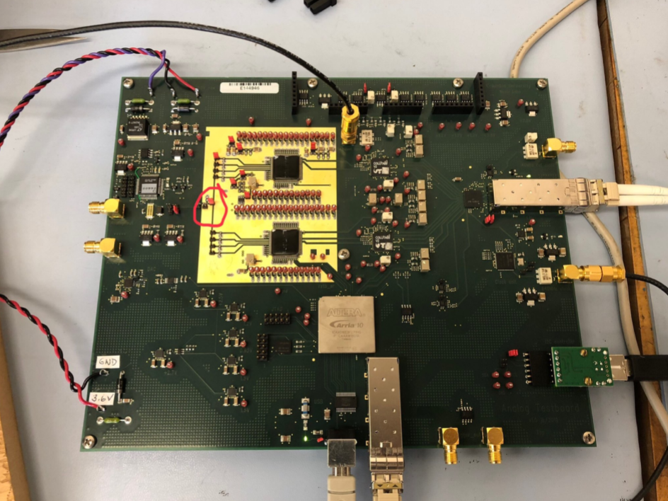

Analog Test Board Standard Data Taking Process
===================================================

Configuration
-------------
Check board is assembled and cabled correctly following instructions at X.

Turn on board, verify current draw is normal,and that "Clock OK" LED is on.

Program the clock using "programClockChip.py", verify that it is successful.

Start GUI using "testBoard.py", if timeout error try reseating USB cable

Press GUI “Configure All” button, wait until configuration process completes

Press GUI “Check Link Ready” button. If the link is not ready, reseat fibre cable and try again, repeat as necessary

In GUI "Trigger" tab, press “Select Calibration Pulses” button ONCE

In GUI “Control” tab, press “Trigger and Take Samples” button and make sure a reasonable waveform is displayed

Pedestal runs
-------------
Power off board and remove jumper shown below to disconnect pulser signal.
 

Ensure number of readout samples specified in GUI is suitably large (4093)

In GUI "Intrumentation" tab, press "Initalize" button. Then press "Pedestal" button.

In GUI "Control" tab, press "Take Repeat" to record pedestal data.

In GUI "COLUTA1" tab, check or uncheck Gain box for 1x or 4x COLUTA DRE mode.

Note the run number and close the GUI.

Pulser runs
-----------
Power off board and place jumper shown previously to connect pulser signal.

Ensure number of readout samples specified in GUI is suitably large (4093).

In GUI "Trigger" tab, press “Select Calibration Pulses” button ONCE.

In GUI "Control" tab, press "Take Standard Set of Runs" to record internal pulser data.
